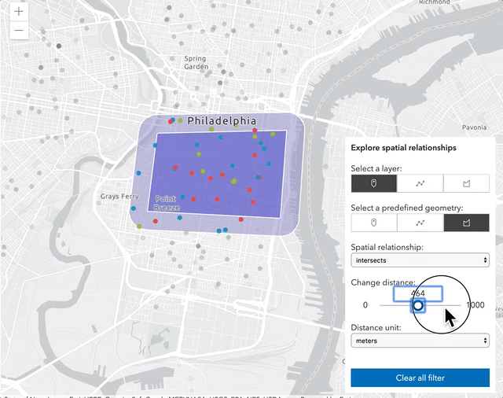
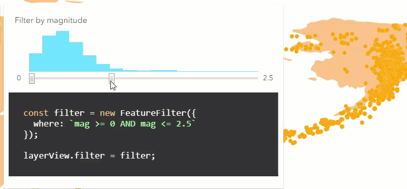
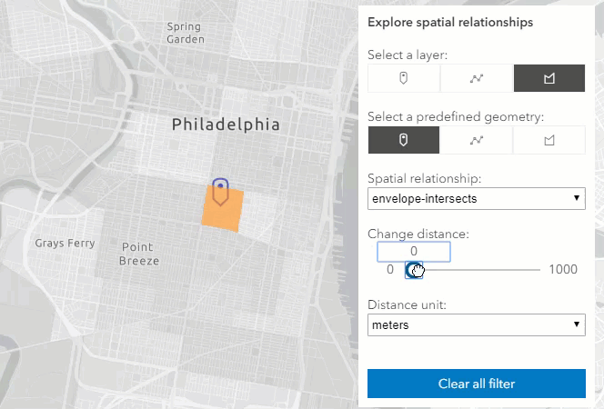
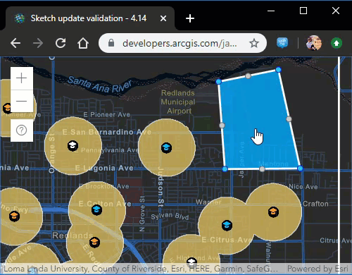

<!-- .slide: data-background="../../reveal.js/img/2020/devsummit/bg-4.png" -->

<h1 style="font-size: 60px;">Interactive Client-Side Mapping<br>with the ArcGIS API for JavaScript</h1>
<p style="font-size: 30px;">Undral Batsukh [<a href="mailto:ubatshukh@esri.com">ubatshukh@esri.com</a>] | Richie Carmichael [<a href="https://github.com/kiwiRichie">@kiwiRichie</a>]</p>
<p style="font-size: 30px;"><code><a href="https://git.io/JvB8u">https://git.io/JvB8u</a> (<a href="?print-pdf">printer friendly</a>)</code></p>

---

<!-- .slide: data-background="../../reveal.js/img/2020/devsummit/bg-2.png" -->

### Agenda

- Client-side Layers
  - [FeatureLayer](https://developers.arcgis.com/javascript/latest/api-reference/esri-layers-FeatureLayer.html), [CSVLayer](https://developers.arcgis.com/javascript/latest/api-reference/esri-layers-CSVLayer.html), [GeoJSONLayer](https://developers.arcgis.com/javascript/latest/api-reference/esri-layers-GeoJSONLayer.html)
- [Query](https://developers.arcgis.com/javascript/latest/api-reference/esri-tasks-support-Query.html)
  - Layer vs LayerView
  - Client-side query
- [Filters](https://developers.arcgis.com/javascript/latest/api-reference/esri-views-layers-support-FeatureFilter.html) and [Effects](https://developers.arcgis.com/javascript/latest/api-reference/esri-views-layers-support-FeatureEffect.html)
  - Adjusting client-side visuals
- [Geometry Engine](https://developers.arcgis.com/javascript/latest/api-reference/esri-geometry-geometryEngine.html), [Projection Engine](https://developers.arcgis.com/javascript/latest/api-reference/esri-geometry-projection.html) and [Geodesic Utils](https://developers.arcgis.com/javascript/latest/api-reference/esri-geometry-support-geodesicUtils.html)
  - Client-side analysis

---

<!-- .slide: data-background="../../reveal.js/img/2020/devsummit/bg-3.png" -->

## Client-side Layers

---

<!-- .slide: data-background="../../reveal.js/img/2020/devsummit/bg-2.png" -->

### Client-side Layers

  - [CSVLayer](https://developers.arcgis.com/javascript/latest/api-reference/esri-layers-CSVLayer.html)
  - [GeoJSONLayer](https://developers.arcgis.com/javascript/latest/api-reference/esri-layers-GeoJSONLayer.html)
  - [FeatureLayer with feature collections](https://developers.arcgis.com/javascript/latest/api-reference/esri-layers-FeatureLayer.html).

---

<!-- .slide: data-background="../../reveal.js/img/2020/devsummit/bg-2.png" -->

### Client-side Layers

- Fetch all features at once and store them on the client
- Uniform API
- Responsive and fast performance

<div style="display:inline">


</div>

---

<!-- .slide: data-background="../../reveal.js/img/2020/devsummit/bg-2.png" -->

### CSVLayer
- Add data from csv/txt file as points

```ts
    const new CSVLayer({
      url: "https://earthquake.usgs.gov/earthquakes/.../2.5_week.csv",
      copyright: "USGS Earthquakes",
      // SR in which the data will be stored
      spatialReference: { wkid: 102100 },
      delimiter: ",",
      latitudeField: "lat",
      longitudeField: "lon",
      // defaults to "__OBJECTID"
      objectIdField: "myOid",
      // create timeInfo for temporal visualization
      timeInfo: {
        startField: "time", // name of the date field
        // set time interval to one day
        interval: { value: 1, unit: "days" }, 
      }
    })
```

[API Reference](https://developers.arcgis.com/javascript/latest/api-reference/esri-layers-CSVLayer.html)
| [Sample 1](https://developers.arcgis.com/javascript/latest/sample-code/sandbox/index.html?sample=layers-csv)

---

<!-- .slide: data-background="../../reveal.js/img/2020/devsummit/bg-2.png" -->

### CSVLayer - Tips

- X, Y coordinates must be in WGS84 in csv file.
- Specify the layer's spatial reference to improve the performance.
- Not supported: 
  - No z-values support.
  - Cannot add, remove or update features.

---

<!-- .slide: data-background="../../reveal.js/img/2020/devsummit/bg-2.png" -->

### CSVLayer - Tips

- Can pass data by a blob url.
```ts
    const csv = `first_name|Year|latitude|Longitude
                 Undral|2020|40.418|20.553
                 Richie|2018|-118|35`;

    const blob = new Blob([csv], {
      type: "plain/text"
    });
    let url = URL.createObjectURL(blob);

    const layer = new CSVLayer({
      url: url
    });
    await layer.load();

    URL.revokeObjectURL(url);
    url = null;
```

---

<!-- .slide: data-background="../../reveal.js/img/2020/devsummit/bg-2.png" -->

### FeatureLayer

- Add client-side graphics by setting _FeatureLayer.source_

```ts
  const layer = new FeatureLayer({
    source: [
      new Graphic({ attributes: { myOid: 1 }, geometry: { ... } })
      new Graphic({ attributes: { myOid: 2 }, geometry: { ... } })
      new Graphic({ attributes: { myOid: 3 }, geometry: { ... } })
    ],
    // can be inferred from geometries
    geometryType: "point",
    // can be inferred from geometries
    spatialReference: { wkid: 2154 },
    // can be inferred from fields w/ field.type "oid"
    objectIdField: "myOid",

    fields: [
      new Field({ name: "myOid", type: "oid" })
    ]
  })
```

[API Reference](https://developers.arcgis.com/javascript/latest/api-reference/esri-layers-FeatureLayer.html#client-side) | [Sample 1](https://developers.arcgis.com/javascript/latest/sample-code/sandbox/index.html?sample=layers-featurelayer-collection)

---

<!-- .slide: data-background="../../reveal.js/img/2020/devsummit/bg-2.png" -->

### FeatureLayer - Tips

- Supports data in any spatial reference.
- Specify _source_ only at the time of initialization.
- Use [FeatureLayer.applyEdits](https://developers.arcgis.com/javascript/latest/api-reference/esri-layers-FeatureLayer.html#applyEdits) to add, remove or update features at runtime.
- Call [FeatureLayer.queryFeatures](https://developers.arcgis.com/javascript/latest/api-reference/esri-layers-FeatureLayer.html#queryFeatures) to get the updated feature collection.

[Sample - add/remove graphics](https://developers.arcgis.com/javascript/latest/sample-code/sandbox/index.html?sample=layers-featurelayer-collection-edits)

---

<!-- .slide: data-background="../../reveal.js/img/2020/devsummit/bg-2.png" -->

### GeoJSONLayer

- Add [GeoJson](https://geojson.org/) data that comply with the [RFC 7946 specification](https://tools.ietf.org/html/rfc7946)

```ts
  const geoJSONLayer = new GeoJSONLayer({
    url: "https://earthquake.usgs.gov/earthquakes/.../all_month.geojson",
    copyright: "USGS Earthquakes",
    // SR in which the data will be stored
    spatialReference: { wkid: 102100 }
  });
```

[API Reference](https://developers.arcgis.com/javascript/latest/api-reference/esri-layers-GeoJSONLayer.html)
| [Time-aware GeoJSONLayer](https://developers.arcgis.com/javascript/latest/sample-code/sandbox/index.html?sample=timeslider-filter)

---

<!-- .slide: data-background="../../reveal.js/img/2020/devsummit/bg-2.png" -->

### GeoJSONLayer - Tips

<ul style="min-width:1000px !important">
  <li> Specify layer's spatial reference for performance.</li>
  <li> Support for <i>Feature</i> and <i>FeatureCollection</i> </li>
  <li> <a href="https://developers.arcgis.com/javascript/latest/api-reference/esri-layers-GeoJSONLayer.html#applyEdits">GeoJSONLayer.applyEdits</a> to add, delete or update features.</li>
</ul>

- Not supported:
  - Mixed geometry types for consistency with other layers.
  - `crs` object - only geographic coordinates using WGS84 datum (long/lat)
  - No Antimeridian crossing
  - Feature `id` as `string`

---

<!-- .slide: data-background="../../reveal.js/img/2020/devsummit/bg-2.png" -->

#### GeoJSONLayer - Tips

- Create a blob url from GeoJSON object

```ts
const geojson = `{
 type: "FeatureCollection",
 features: [{
   type: "Feature",
   geometry: { type: "Point", coordinates: [-100, 40] },
   properties: { name: "none" }
 }]
}`;

const blob = new Blob([JSON.stringify(geojson)], {
  type: "application/json"
});
let url = URL.createObjectURL(blob);
const layer = new GeoJSONLayer({ url });

await layer.load();
URL.revokeObjectURL(url);
url = null;
```

---

<!-- .slide: data-background="../../reveal.js/img/2020/devsummit/bg-2.png" -->

### Client-side layers tips

- Each implementation uses the client-side query engine.
- Prefer `GeoJSON` over `CSV`.
- Proper attribution using `copyright` property.

---

<!-- .slide: data-background="../../reveal.js/img/2020/devsummit/bg-3.png" -->

### Query

---

<!-- .slide: data-background="../../reveal.js/img/2020/devsummit/bg-2.png" -->

### Query

- Query expressions are used to select a subset of features and table records.
- Query can be done on the server or on the client-side.
- Different `query...` methods are available on Layers and LayerViews.

---

<!-- .slide: data-background="../../reveal.js/img/2020/devsummit/bg-2.png" -->

### Layers and Layer Views

- Server-side layers
  - Fetch or stream features on demand
  - [FeatureLayer](https://developers.arcgis.com/javascript/latest/api-reference/esri-layers-FeatureLayer.html) created from a service, [SceneLayer](https://developers.arcgis.com/javascript/latest/api-reference/esri-layers-SceneLayer.html)
  - A [LayerView](https://developers.arcgis.com/javascript/latest/api-reference/esri-views-layers-LayerView.html) represents the view for a single layer after it has been added to a View. 
  - LayerView API is layer agnostic.
  - Methods and properties used for features available for drawing on the client-side.

---

<!-- .slide: data-background="../../reveal.js/img/2020/devsummit/bg-2.png" -->

### Client-side query

- `(CSV|GeoJSON)Layer` and `FeatureLayer/FeatureCollection`
- `(CSV|GeoJSON|Feature|Scene|Stream)LayerView`
- Query methods on layer and layerView
  - `queryFeatures()`
  - `queryFeatureCount()`
  - `queryObjectIds()`
  - `queryExtent()`

[Layer vs LayerView](https://codepen.io/U_B_U/pen/poJLgxo?editors=1000) |
[Age Pyramid](https://developers.arcgis.com/javascript/latest/sample-code/sandbox/index.html?sample=featurelayerview-query-geometry) |
[3D buildings](https://developers.arcgis.com/javascript/latest/sample-code/sandbox/index.html?sample=layers-scenelayerview-query-stats)

---

<!-- .slide: data-background="../../reveal.js/img/2020/devsummit/bg-2.png" -->

### Query tips

<table style="min-width:1000px; color: black">
  <tr style="background-color: white; color: black; font-size: 32px;">
    <th style= "border: 1px solid #ddd;">When to use</th>
    <th style= "border: 1px solid #ddd;">Layer queries</th>
    <th style= "border: 1px solid #ddd;">LayerView queries</th>
  </tr>
  <tr style="font-size: 26px; background-color: #f2f2f2; color: black">
    <td style= "border: 1px solid #ddd;">Speed and responseviness</td>
    <td style= "border: 1px solid #ddd;">No(server layer) <br> Yes(client layers)</td>
    <td style= "border: 1px solid #ddd;">Yes. Client-side query</td>
  </tr>
  <tr style="font-size: 26px; background-color: white; color: black">
    <td style= "border: 1px solid #ddd;">Query all features</td>
    <td style= "border: 1px solid #ddd;">Yes</td>
    <td style= "border: 1px solid #ddd;">No. Features available for drawing</td>
  </tr>
  <tr style="font-size: 26px; background-color: #f2f2f2; color: black">
    <td style= "border: 1px solid #ddd;">Geometry precision</td>
    <td style= "border: 1px solid #ddd;">Yes</td>
    <td style= "border: 1px solid #ddd;">No. Quantized/generalized</td>
  </tr>
</table>

---

<!-- .slide: data-background="../../reveal.js/img/2020/devsummit/bg-3.png" -->

## Filters

---

<!-- .slide: data-background="../../reveal.js/img/2020/devsummit/bg-2.png" -->

### What are filters?

- Reduce the number of features shown screen
- Can apply spatial, aspatial, temporal (or any combination)
```js
    featureLayerView.filter = new FeatureFilter({
      geometry: myGeometry      // Spatial
      timeExtent: myTimeExtent, // Temporal
      where: myWhere            // Aspatial
    });
```
- Client-side
  - Only applied to features currently downloaded
  - Fast.
- [FeatureFilter](https://developers.arcgis.com/javascript/latest/api-reference/esri-views-layers-support-FeatureFilter.html) has the same properties as [Query](https://developers.arcgis.com/javascript/latest/api-reference/esri-tasks-support-Query.html)

---

<!-- .slide: data-background="../../reveal.js/img/2020/devsummit/bg-2.png" -->

### Spatial Filter
Only show buildings within 10 miles of the mouse cursor

```js

    mapView.on("pointer-move", (event) => {
      buildingLayerView.filter = new FeatureFilter({
        geometry: mapView.toMap({
          event.x,
          event.y
        }),
        distance: 10,
        units: "miles"
      })
    });


```

---

<!-- .slide: data-background="../../reveal.js/img/2020/devsummit/bg-2.png" -->

### Aspatial Filter
Only show earthquakes with a magnitude greater than 7

```js

    featureLayerView.filter = new FeatureFilter({
      where: "magnitude >= 7"
    });


```

---

<!-- .slide: data-background="../../reveal.js/img/2020/devsummit/bg-2.png" -->

### Temporal Filter
Only show earthquakes that occured between 2000 and 2007

```js

    featureLayerView.filter = new FeatureFilter({
      timeExtent: new TimeExtent({
        start: new Date(2000, 0, 1),
        end: new Date(2007, 0, 1)
      })
    });


```

---

<!-- .slide: data-background="../../reveal.js/img/2020/devsummit/bg-2.png" -->

#### Demonstration - [filters](https://ycabon.github.io/2019-devsummit-plenary/3_filter_effect.html)



---

<!-- .slide: data-background="../../reveal.js/img/2020/devsummit/bg-3.png" -->

## Effects

---

<!-- .slide: data-background="../../reveal.js/img/2020/devsummit/bg-2.png" -->

### [What are effects?](https://developers.arcgis.com/javascript/latest/api-reference/esri-views-layers-support-FeatureEffect.html)

- Visual effects applied to included or excluded features.



---

<!-- .slide: data-background="../../reveal.js/img/2020/devsummit/bg-2.png" -->

### Effect - Snippet

Show earthquakes with a magnitude of 7 or greater as faint shadows

```js

    // Show quakes less than 7 magnitude as faint shadows.
    featureLayerView.effect = new FeatureEffect({
      filter: new FeatureFilter({
        where: "magnitude >= 7"
      }),
      excludedEffect: "grayscale(100%) opacity(0.5)",
      // includedEffect: "saturate(150%)"
    });


```

---

<!-- .slide: data-background="../../reveal.js/img/2020/devsummit/bg-2.png" -->

#### Demonstration - [century of quakes](demos/century-of-earthquakes.html)


---

<!-- .slide: data-background="../../reveal.js/img/2020/devsummit/bg-2.png" -->

### Supported Effects

```css

    /* effect(default-value) */
    brightness(0.4);
    contrast(200%);
    grayscale(50%);
    hue-rotate(90deg);
    invert(75%);
    opacity(25%);
    saturate(30%);
    sepia(60%);


```

[CSS reference](https://developer.mozilla.org/en-US/docs/Web/CSS/filter)

---

<!-- .slide: data-background="../../reveal.js/img/2020/devsummit/bg-3.png" -->

## Geometry Engine

---

<!-- .slide: data-background="../../reveal.js/img/2020/devsummit/bg-2.png" -->

### One Engine - Thirty Methods

- Compute new geometries<br/>
  _e.g. [buffer](https://developers.arcgis.com/javascript/latest/api-reference/esri-geometry-geometryEngineAsync.html#buffer), [clip](https://developers.arcgis.com/javascript/latest/api-reference/esri-geometry-geometryEngineAsync.html#clip), [densify](https://developers.arcgis.com/javascript/latest/api-reference/esri-geometry-geometryEngineAsync.html#densify), [generalize](https://developers.arcgis.com/javascript/latest/api-reference/esri-geometry-geometryEngineAsync.html#generalize)_

- Testing spatial relationship<br/>
  _e.g. [contains](https://developers.arcgis.com/javascript/latest/api-reference/esri-geometry-geometryEngineAsync.html#contains), [crosses](https://developers.arcgis.com/javascript/latest/api-reference/esri-geometry-geometryEngineAsync.html#crosses), [intersects](https://developers.arcgis.com/javascript/latest/api-reference/esri-geometry-geometryEngineAsync.html#intersects)_

- Advanced computations<br/>
  _e.g. [geodesicArea](https://developers.arcgis.com/javascript/latest/api-reference/esri-geometry-geometryEngineAsync.html#geodesicArea), [planarArea](https://developers.arcgis.com/javascript/latest/api-reference/esri-geometry-geometryEngineAsync.html#planarArea)_

---

<!-- .slide: data-background="../../reveal.js/img/2020/devsummit/bg-2.png" -->

### One Engine - Two Flavors

- [geometryEngine](https://developers.arcgis.com/javascript/latest/api-reference/esri-geometry-geometryEngine.html)
```js
    const geometryEngine = new GeometryEngine();
    const length = geometryEngine.planarLength(myPolyline, "meters");
    console.log("length(m)", length);
```

- [geometryEngineAsync](https://developers.arcgis.com/javascript/latest/api-reference/esri-geometry-geometryEngineAsync.html)
```js
    const geometryEngine = new GeometryEngineAsync();
    geometryEngine.planarLength(myPolyline, "meters").then((length) => {
      console.log("length(m)", length);
    });
```

---

<!-- .slide: data-background="../../reveal.js/img/2020/devsummit/bg-2.png" -->

#### Demonstration - [Sketch Validation](https://developers.arcgis.com/javascript/latest/sample-code/sketch-update-validation/live/index.html)



---

<!-- .slide: data-background="../../reveal.js/img/2020/devsummit/bg-2.png" -->

### Wait, what about [GeometryService](https://developers.arcgis.com/javascript/latest/api-reference/esri-tasks-GeometryService.html)?

- Same methods as [GeometryEngine](https://developers.arcgis.com/javascript/latest/api-reference/esri-geometry-geometryEngine.html)/[GeometryEngineAsync](https://developers.arcgis.com/javascript/latest/api-reference/esri-geometry-geometryEngineAsync.html)
- Sends request to remote server for computation
- **Pro:**
  - May be faster for complex computations
- **Con:**
  - May be slower due to network latency

---

<!-- .slide: data-background="../../reveal.js/img/2020/devsummit/bg-2.png" -->

### GeometryService - Snippet

```js

    const parameters = new LengthsParameters({
      calculationType: "planar",
      lengthUnit: "esriSRUnit_Meter",
      polylines: [myPolyline]
    });

    const geometryService = new GeometryService({
      url: "http://sampleserver6.arcgisonline.com/arcgis/rest/services/" +
           "Utilities/Geometry/GeometryServer"
    });

    geometryService.lengths(parameters).then((response) => {
        console.log("length(m)", response.lengths[0]);
    });


```

---

<!-- .slide: data-background="../../reveal.js/img/2020/devsummit/bg-3.png" -->

### Projection Engine

---

<!-- .slide: data-background="../../reveal.js/img/2020/devsummit/bg-2.png" -->

### What is Projection Engine

- Client-side module for projecting geometries between coordinate systems
- Based on the engine used by Runtime
- Uses [WebAssembly](https://webassembly.github.io/spec/)
  - Not support by Internet Explorer (see [caniuse](https://caniuse.com/#feat=wasm))

---

<!-- .slide: data-background="../../reveal.js/img/2020/devsummit/bg-2.png" -->

### Loading the Projection Engine

```js

    const projection = new Projection();

    if (!projection.isSupported()) {
      console.error("projection is not supported");
      return;
    }

    if (projection.isLoaded()) {
      console.log("projection already loaded");
      return;
    }

    projection.load().then(() => {
      console.log("projection loaded");
    });


```

---

<!-- .slide: data-background="../../reveal.js/img/2020/devsummit/bg-2.png" -->

#### Demonstration - [Projection](https://developers.arcgis.com/javascript/latest/sample-code/client-projection/live/index.html)


---

<!-- .slide: data-background="../../reveal.js/img/2020/devsummit/bg-3.png" -->

### Geodesic Utils

---

<!-- .slide: data-background="../../reveal.js/img/2020/devsummit/bg-2.png" -->

### What is Geodesic Utils?

- Lightweight module for performing geodesic computations

- Some redundancy with GeometryEngine (GE)
  - GU.[geodesicAreas()](https://developers.arcgis.com/javascript/latest/api-reference/esri-geometry-support-geodesicUtils.html#geodesicAreas) vs. GE.[geodesicArea()](https://developers.arcgis.com/javascript/latest/api-reference/esri-geometry-geometryEngineAsync.html#geodesicArea)
  - GU.[geodesicDensify()](https://developers.arcgis.com/javascript/latest/api-reference/esri-geometry-support-geodesicUtils.html#geodesicDensify) vs. GE.[geodesicDensify()](https://developers.arcgis.com/javascript/latest/api-reference/esri-geometry-geometryEngineAsync.html#geodesicDensify)
  - GU.[geodesicLengths()](https://developers.arcgis.com/javascript/latest/api-reference/esri-geometry-support-geodesicUtils.html#geodesicLengths) vs. GE.[geodesicLength()](https://developers.arcgis.com/javascript/latest/api-reference/esri-geometry-geometryEngineAsync.html#geodesicLength)

- Works on any supported geographic coordinate system include 70+ non-terrestrial systems (e.g. Mars and Moon)

---

<!-- .slide: data-background="../../reveal.js/img/2020/devsummit/bg-2.png" -->

### Geodesic Utils - Example

What is the area of the Bermuda Triangle?

```js

    const MIAMI    = { lat: 25.775278, lon: -80.208889 };  // Florida
    const HAMILTON = { lat: 32.293, lon: -64.782 };        // Bermuda
    const SANJUAN  = { lat: 18.406389, lon:  -66.063889 }; // Puerto Rico
    const polygon = new Polygon({
      rings: [[
        [MIAMI.lon, MIAMI.lat],
        [HAMILTON.lon, HAMILTON.lat],
        [SANJUAN.lon, SANJUAN.lat],
        [MIAMI.lon, MIAMI.lat]
      ]]
    });
    const areas = geodesicUtils.geodesicAreas([polygon], "square-kilometers");
    const area = Math.round(areas[0]);
    console.log(`Area: ${area} km²`); // Area: 1150498 km²


```

---

<!-- .slide: data-background="../../reveal.js/img/2020/devsummit/bg-2.png" -->

### Geodesic Utils - [Mars Rovers](demos/mars-rovers.html)

How far is [Curiosity](https://en.wikipedia.org/wiki/Curiosity_(rover)) (active) from [Opportunity](https://en.wikipedia.org/wiki/Opportunity_(rover)) on [Mars](https://en.wikipedia.org/wiki/Mars)?

```js
    const polyline = new Polyline({
      spatialReference: {
        wkid: 104905 // Mars 2000 Coordinate System
      }
    });
    polyline.addPath([ curiosity.geometry, opportunity.geometry ]);

    const distance  = geodesicUtils.geodesicLengths([polyline], "kilometers")[0];
    const densified = geodesicUtils.geodesicDensify(polyline, 100);

    const path = new Graphic({
      attributes: {
        oid: 1,
        distance
      },
      geometry: densified
    });
```

---

<!-- .slide: data-background="../../reveal.js/img/2020/devsummit/bg-3.png" -->

