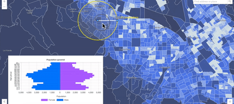
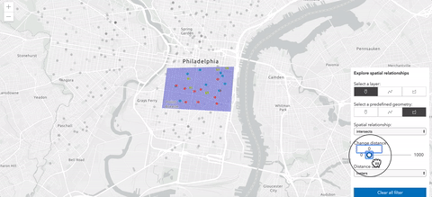

<!-- .slide: data-background="../../reveal.js/img/2020/devsummit/bg-4.png" -->

<h1 style="font-size: 60px;">Interactive Client-Side Mapping<br>with the ArcGIS API for JavaScript</h1>
<p style="font-size: 30px;">Undral Batsukh [<a href="mailto:ubatshukh@esri.com">ubatshukh@esri.com</a>] | Richie Carmichael [<a href="https://github.com/kiwiRichie">@kiwiRichie</a>]</p>
<p style="font-size: 30px;"><code><a href="https://git.io/JvB8u">https://git.io/JvB8u</a> (<a href="?print-pdf">printer friendly</a>)</code></p>

---

<!-- .slide: data-background="../../reveal.js/img/2020/devsummit/bg-2.png" -->

### Agenda

- Client-side Layers (U)
  - [FeatureLayer](https://developers.arcgis.com/javascript/latest/api-reference/esri-layers-FeatureLayer.html), [CSVLayer](https://developers.arcgis.com/javascript/latest/api-reference/esri-layers-CSVLayer.html), [GeoJSONLayer](https://developers.arcgis.com/javascript/latest/api-reference/esri-layers-GeoJSONLayer.html) and more...
  - Layer vs LayerViews
- [Query](https://developers.arcgis.com/javascript/latest/api-reference/esri-tasks-support-Query.html) (U)
  - How to search time and space?
  - How and why to search locally?
- [Filters](https://developers.arcgis.com/javascript/latest/api-reference/esri-views-layers-support-FeatureFilter.html) and [Effects](https://developers.arcgis.com/javascript/latest/api-reference/esri-views-layers-support-FeatureEffect.html) (R)
- [Geometry Engine](https://developers.arcgis.com/javascript/latest/api-reference/esri-geometry-geometryEngine.html), [Projection Engine](https://developers.arcgis.com/javascript/latest/api-reference/esri-geometry-projection.html) and [Geodesic Utils](https://developers.arcgis.com/javascript/latest/api-reference/esri-geometry-support-geodesicUtils.html) (R)
  - What are they and why do we care?

---

<!-- .slide: data-background="../../reveal.js/img/2020/devsummit/bg-3.png" -->

### Client-side Layers

- Fetch all features at once. All features are available on the client-side.
- Uniform API
- Responsive and fast performance.

| query | filter |
| ----- | ------ |
| ||

---

<!-- .slide: data-background="../../reveal.js/img/2020/devsummit/bg-3.png" -->

### Client-side Layers

  - [CSVLayer](https://developers.arcgis.com/javascript/latest/api-reference/esri-layers-CSVLayer.html)
  - [GeoJSONLayer](https://developers.arcgis.com/javascript/latest/api-reference/esri-layers-GeoJSONLayer.html)
  - [FeatureLayer with feature collections](https://developers.arcgis.com/javascript/latest/api-reference/esri-layers-FeatureLayer.html).

---

<!-- .slide: data-background="../../reveal.js/img/2020/devsummit/bg-3.png" -->

### CSVLayer

```ts
const new CSVLayer({
  url: "https://earthquake.usgs.gov/earthquakes/feed/v1.0/summary/2.5_week.csv",
  copyright: "USGS Earthquakes",
  // SR in which the data will be stored
  spatialReference: { wkid: 102100 },
  delimiter: ",",
  latitudeField: "lat",
  longitudeField: "lon",
  // defaults to "__OBJECTID"
  objectIdField: "myOid",
  // create timeInfo for temporal visualization
  timeInfo: {
    startField: "time", // name of the date field
    interval: {
      // set time interval to one day
      unit: "days",
      value: 1
    }
   }
})
```

[API Reference](https://developers.arcgis.com/javascript/latest/api-reference/esri-layers-CSVLayer.html)
| [Sample 1](https://developers.arcgis.com/javascript/latest/sample-code/sandbox/index.html?sample=layers-csv) |[Sample 2](https://developers.arcgis.com/javascript/latest/sample-code/sandbox/index.html?sample=highlight-features-by-geometry)

---

<!-- .slide: data-background="../../reveal.js/img/2020/devsummit/bg-3.png" -->

### CSVLayer - Tips

- Specify the layer's spatial reference.
- Pass data by a blob url.
- No z-values support for now.

```ts
const csv = `
first_name|Year|latitude|Longitude
Undral|2020|40.418|20.553
Richie|2018|-118|35
`;
const blob = new Blob([csv], {
  type: "plain/text"
});
let url = URL.createObjectURL(blob);

const layer = new CSVLayer({
  url: url
});

await layer.load();

URL.revokeObjectURL(url);
url = null;
```

---

<!-- .slide: data-background="../../reveal.js/img/2020/devsummit/bg-3.png" -->

### FeatureLayer with feature collections

```ts
const layer = new FeatureLayer({
  source: [
    new Graphic({ attributes: { myOid: 1 }, geometry: { ... } })
    new Graphic({ attributes: { myOid: 2 }, geometry: { ... } })
    new Graphic({ attributes: { myOid: 3 }, geometry: { ... } })
  ],

  // can be inferred from geometries
  geometryType: "point",
  // can be inferred from geometries
  spatialReference: { wkid: 2154 },
  // can be inferred from fields w/ field.type "oid"
  objectIdField: "myOid",

  fields: [
    new Field({
      name: "myOid",
      type: "oid"
    })
  ]
})
```

---

<!-- .slide: data-background="../../reveal.js/img/2020/devsummit/bg-3.png" -->

### FeatureLayer with feature collections - Tips

- Supports data in any spatial reference.
- Specify source only at the time of initialization.
- Use FeatureLayer.applyEdits to add, remove or update features at runtime.
- Call FeatureLayer.queryFeatures to get the update feature collection.

[SDK Doc](https://developers.arcgis.com/javascript/latest/api-reference/esri-layers-FeatureLayer.html#client-side) | [Sample 1](https://developers.arcgis.com/javascript/latest/sample-code/sandbox/index.html?sample=layers-featurelayer-collection) | [Sample 2](https://developers.arcgis.com/javascript/latest/sample-code/sandbox/index.html?sample=layers-featurelayer-collection-edits)

---

<!-- .slide: data-background="../../reveal.js/img/2020/devsummit/bg-3.png" -->

### GeoJSONLayer

```ts
const geoJSONLayer = new GeoJSONLayer({
  url:
    "https://earthquake.usgs.gov/earthquakes/feed/v1.0/summary/all_month.geojson",
  copyright: "USGS Earthquakes"
});
```

[API Reference](https://developers.arcgis.com/javascript/latest/api-reference/esri-layers-GeoJSONLayer.html)
| [Sample 1](https://developers.arcgis.com/javascript/latest/sample-code/sandbox/index.html?sample=timeslider-filter)

---

<!-- .slide: data-background="../../reveal.js/img/2020/devsummit/bg-3.png" -->

### GeoJSONLayer - Tips

- Specify the layer's spatial reference
- Create a blob url from GeoJSON object
- Call GeoJSONLayer.applyEdits to add, delete or update features.

```ts
const geojson = `
{
  type: "FeatureCollection",
  features: [
    {
      type: "Feature",
      geometry: { type: "Point", coordinates: [-100, 40] },
      properties: { name: "none" }
    }
  ]
}
`;

const blob = new Blob([JSON.stringify(geojson)], {
  type: "application/json"
});

let url = URL.createObjectURL(blob);

const layer = new GeoJSONLayer({
  url
});

await layer.load();

URL.revokeObjectURL(url);
url = null;
```

---

<!-- .slide: data-background="../../reveal.js/img/2020/devsummit/bg-3.png" -->

### GeoJSONLayer - Tips

- Fix [elevation data](https://earthquake.usgs.gov/earthquakes/feed/v1.0/geojson.php)

```ts
const url =
  "https://earthquake.usgs.gov/earthquakes/feed/v1.0/summary/all_month.geojson";

const layer = new GeoJSONLayer({
  url,
  title: "USGS Earthquakes",
  copyright: "USGS",
  definitionExpression: "type = 'earthquake'",

  elevationInfo = {
    mode: "absolute-height",
    unit: "kilometers",
    featureExpressionInfo: {
      expression: "Geometry($feature).z * -1"
    }
  }
});
```

[Plenary Demo](https://ycabon.github.io/2019-devsummit-plenary/2_geojson.html)

---

<!-- .slide: data-background="../../reveal.js/img/2020/devsummit/bg-3.png" -->

### GeoJSONLayer

- Implementation of the spec [`rfc7946`](https://tools.ietf.org/html/rfc7946)
- Support for `"Feature"` and `"FeatureCollection"`
- Not supported:
  - Mixed geometry types for consistency with other layers.
  - `crs` object - only geographic coordinates using WGS84 datum (long/lat)
  - No Antimeridian crossing

---

<!-- .slide: data-background="../../reveal.js/img/2020/devsummit/bg-3.png" -->

### GeoJSONLayer

- Not supported, maybe pile:
  - `"GeometryCollection"` object
  - TopoJSON
  - Feature `id` as `string`
- Not supported yet but will be:
  - Export back to GeoJSON
  - Loading a `GeoJSONLayer` using a `GeoJSON` object
  - WebMap spec
  - `queryParameters` and `refresh()`

---

<!-- .slide: data-background="../../reveal.js/img/2020/devsummit/bg-3.png" -->

### Client-side layers tips

- Each implementation uses the client-side query engine.
- Pick what's best for your usage.
- Prefer `GeoJSON` over `CSV`.
- Proper attribution using `copyright` property.
- _"With [`GeoJSON`](./demos/geojson_or_featurelayer/geojson.html) I ditch my [`FeatureLayer`](./demos/geojson_or_featurelayer/featureLayer.html)"_ NO!!!
- [Quantization benefits](https://github.com/ycabon/quantization/)
- Use query on the layer if the geometry accrucary 

---

<!-- .slide: data-background="../../reveal.js/img/2020/devsummit/bg-3.png" -->

### Layers and Layer Views

- Server-side
  - _(fetch or stream features on demand)_
  - FeatureLayer
  - SceneLayer
- LayerView
- A [LayerView](https://developers.arcgis.com/javascript/latest/api-reference/esri-views-layers-LayerView.html) represents the view for a single layer after it has been added to either a MapView or a SceneView. 
- LayerView API is layer agnostic. Methods, properties on LayerView only work against features available for drawing.

---

---

<!-- .slide: data-background="../../reveal.js/img/2020/devsummit/bg-3.png" -->

### Layers and Layer Views
| Layer | LayerView | When to use  | 
| ------| --------- | ---- |
| Query issued against all features available in the layer | Query issued against features available for drawing. 

---

<!-- .slide: data-background="../../reveal.js/img/2020/devsummit/bg-3.png" -->

### Query

---

<!-- .slide: data-background="../../reveal.js/img/2020/devsummit/bg-3.png" -->

### Filters

_Client-side spatial/aspatial/temporal filtering._

```js
// Only show earthquakes that occured between 2000 and 2006.
featureLayerView.filter = new FeatureFilter({
  timeExtent: new TimeExtent({
    start: new Date(2000, 0, 1),
    end: new Date(2007, 0, 1)
  })
});
```

```js
// Only show buildings within 10 miles of the mouse cursor.
mapView.on("pointer-move", function(e) {
  buildingLayerView.filter = {
    geometry: mapView.toMap({e.x, e.y}),
    distance: 10,
    units: "miles"
  }
});
```

---

<!-- .slide: data-background="../../reveal.js/img/2020/devsummit/bg-2.png" -->

### [Effects](https://developers.arcgis.com/javascript/latest/api-reference/esri-views-layers-support-FeatureEffect.html)

_Visual effects applied to included/excluded features._

```js
// Show quakes less than 7 magnitude as faint shadows.
featureLayerView.effect = new FeatureEffect({
  filter: {
    where: "magnitude >= 7"
  }
  excludedEffect: "grayscale(100%) opacity(0.5)"
});
```

[Plenary Demo](https://ycabon.github.io/2019-devsummit-plenary/3_filter_effect.html)

---

<!-- .slide: data-background="../../reveal.js/img/2020/devsummit/bg-2.png" -->

### Supported Effects (w/ default values)

```css
// brightness(0.4);
// contrast(200%);
// grayscale(50%);
// hue-rotate(90deg);
// invert(75%);
// opacity(25%);
// saturate(30%);
// sepia(60%);
```

[CSS reference](https://developer.mozilla.org/en-US/docs/Web/CSS/filter)

---

### Filter/Effects Demonstration - TODO

Create sample based on:
http://tui/GitHub/richiecarmichael.github.io/quake-map/index.html

---

<!-- .slide: data-background="../../reveal.js/img/2020/devsummit/bg-4.png" -->

### Demonstration - [Century of Quakes](demos/century-of-earthquakes.html)


---

<!-- .slide: data-background="../../reveal.js/img/2020/devsummit/bg-2.png" -->

### Geometry Engine

---

<!-- .slide: data-background="../../reveal.js/img/2020/devsummit/bg-2.png" -->

### Projection Engine

---

<!-- .slide: data-background="../../reveal.js/img/2020/devsummit/bg-2.png" -->

### Geodesic Utils

---

<!-- .slide: data-background="../../reveal.js/img/2020/devsummit/bg-rating.png" -->

---

<!-- .slide: data-background="../../reveal.js/img/2020/devsummit/bg-3.png" -->


<!-- *** LAST YEAR ***

---

### Client-side query

- `(CSV|GeoJSON)Layer`
- `(CSV|GeoJSON|Feature|Scene)LayerView`
  - `queryFeatures()`
  - `queryFeatureCount()`
  - `queryObjectIds()`
  - `queryExtent()`

[Age Pyramid](https://developers.arcgis.com/javascript/latest/sample-code/featurelayerview-query-geometry/live/index.html),
[Homicides](https://developers.arcgis.com/javascript/latest/sample-code/featurelayerview-query-distance/live/index.html),
[3D buildings](https://developers.arcgis.com/javascript/latest/sample-code/layers-scenelayerview-query-stats/live/index.html)

---

### Client-side query

- Features aren't always as they seem!
  - Quantized/generalized geometries in FeatureLayer
  - Very small features may not be present even if technically within the view's extent

[Query neighbors](https://ekenes.github.io/esri-ts-samples/query/neighbor-comparison/touches.html)

---

#### Client-side layers

```js
const url = "https://earthquake.usgs.gov/earthquakes/feed/v1.0/"
const geoJSONLayer = new GeoJSONLayer({
  url: url + "summary/all_month.geojson",
  copyright: "USGS Earthquakes"
});
const csvLayer = new CSVLayer({
  url: url + "summary/2.5_week.csv",
  copyright: "USGS Earthquakes"
});
```
```js
const featureLayer = new FeatureLayer({
  source: [
    new Graphic({ attributes: { myOid: 1 }, geometry: { ... } })
    new Graphic({ attributes: { myOid: 2 }, geometry: { ... } })
    new Graphic({ attributes: { myOid: 3 }, geometry: { ... } })
  ],
  fields: [
    new Field({
      name: "myOid",
      type: "oid"
    })
  ]
});
```

---

#### Client-side vs. Server-side

```js
// Query all data on the server.
var query = new Query({
  where: "magnitude >= 5"
});
```
```js
// Query all data on the server.
featureLayer.queryFeatureCount(query).then(function(count){
  console.log(`${count} quakes found.`);  // 54820 quakes found.
});
```
```js
// Query only data downloaded to the browser.
featureLayerView.queryFeatureCount(query).then(function(count){
  console.log(`${count} quakes found.`);  // 9235 quakes found.
});
```

---

-->
