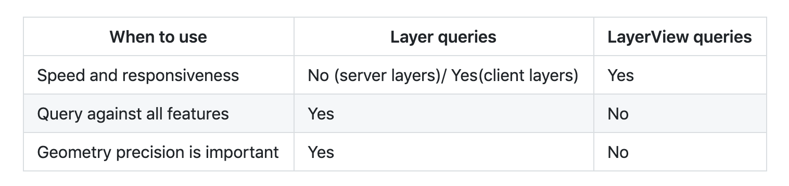

<!-- .slide: data-background="../../reveal.js/img/2020/devsummit/bg-4.png" -->

<h1 style="font-size: 60px;">Interactive Client-Side Mapping<br>with the ArcGIS API for JavaScript</h1>
<p style="font-size: 30px;">Undral Batsukh [<a href="mailto:ubatshukh@esri.com">ubatshukh@esri.com</a>] | Richie Carmichael [<a href="https://github.com/kiwiRichie">@kiwiRichie</a>]</p>
<p style="font-size: 30px;"><code><a href="https://git.io/JvB8u">https://git.io/JvB8u</a> (<a href="?print-pdf">printer friendly</a>)</code></p>

---

<!-- .slide: data-background="../../reveal.js/img/2020/devsummit/bg-2.png" -->

### Agenda

- Client-side Layers
  - [FeatureLayer](https://developers.arcgis.com/javascript/latest/api-reference/esri-layers-FeatureLayer.html), [CSVLayer](https://developers.arcgis.com/javascript/latest/api-reference/esri-layers-CSVLayer.html), [GeoJSONLayer](https://developers.arcgis.com/javascript/latest/api-reference/esri-layers-GeoJSONLayer.html)
- [Query](https://developers.arcgis.com/javascript/latest/api-reference/esri-tasks-support-Query.html)
  - Layer vs LayerViews
  - Attributes, spatial and geometry queries
- [Filters](https://developers.arcgis.com/javascript/latest/api-reference/esri-views-layers-support-FeatureFilter.html) and [Effects](https://developers.arcgis.com/javascript/latest/api-reference/esri-views-layers-support-FeatureEffect.html)
- [Geometry Engine](https://developers.arcgis.com/javascript/latest/api-reference/esri-geometry-geometryEngine.html), [Projection Engine](https://developers.arcgis.com/javascript/latest/api-reference/esri-geometry-projection.html) and [Geodesic Utils](https://developers.arcgis.com/javascript/latest/api-reference/esri-geometry-support-geodesicUtils.html)
  - What are they and why do we care?

---

<!-- .slide: data-background="../../reveal.js/img/2020/devsummit/bg-2.png" -->

### Client-side Layers

- Fetch all features at once and store on the client
- Uniform API
- Responsive and fast performance

<div style="display:inline">


</div>

---

<!-- .slide: data-background="../../reveal.js/img/2020/devsummit/bg-2.png" -->

### Client-side Layers

  - [CSVLayer](https://developers.arcgis.com/javascript/latest/api-reference/esri-layers-CSVLayer.html)
  - [GeoJSONLayer](https://developers.arcgis.com/javascript/latest/api-reference/esri-layers-GeoJSONLayer.html)
  - [FeatureLayer with feature collections](https://developers.arcgis.com/javascript/latest/api-reference/esri-layers-FeatureLayer.html).

---

<!-- .slide: data-background="../../reveal.js/img/2020/devsummit/bg-2.png" -->

### CSVLayer
- Add data from csv/txt file as points

```ts
    const new CSVLayer({
      url: "https://earthquake.usgs.gov/earthquakes/.../2.5_week.csv",
      copyright: "USGS Earthquakes",
      // SR in which the data will be stored
      spatialReference: { wkid: 102100 },
      delimiter: ",",
      latitudeField: "lat",
      longitudeField: "lon",
      // defaults to "__OBJECTID"
      objectIdField: "myOid",
      // create timeInfo for temporal visualization
      timeInfo: {
        startField: "time", // name of the date field
        // set time interval to one day
        interval: { value: 1, unit: "days" }, 
      }
    })
```

[API Reference](https://developers.arcgis.com/javascript/latest/api-reference/esri-layers-CSVLayer.html)
| [Sample 1](https://developers.arcgis.com/javascript/latest/sample-code/sandbox/index.html?sample=layers-csv) | [Sample 2](https://developers.arcgis.com/javascript/latest/sample-code/sandbox/index.html?sample=highlight-features-by-geometry)

---

<!-- .slide: data-background="../../reveal.js/img/2020/devsummit/bg-2.png" -->

### CSVLayer - Tips

- X, Y coordinates must be in WGS84 in csv file.
- Specify the layer's spatial reference to improve the performance.
- Not supported: 
  - No z-values support.
  - Cannot add, remove or update features.

---

<!-- .slide: data-background="../../reveal.js/img/2020/devsummit/bg-2.png" -->

### CSVLayer - Tips

- Can pass data by a blob url.
```ts
    const csv = `first_name|Year|latitude|Longitude
                 Undral|2020|40.418|20.553
                 Richie|2018|-118|35`;

    const blob = new Blob([csv], {
      type: "plain/text"
    });
    let url = URL.createObjectURL(blob);

    const layer = new CSVLayer({
      url: url
    });
    await layer.load();

    URL.revokeObjectURL(url);
    url = null;
```

---

<!-- .slide: data-background="../../reveal.js/img/2020/devsummit/bg-2.png" -->

### FeatureLayer
- Add client-side graphics by setting _FeatureLayer.source_

```ts
  const layer = new FeatureLayer({
    source: [
      new Graphic({ attributes: { myOid: 1 }, geometry: { ... } })
      new Graphic({ attributes: { myOid: 2 }, geometry: { ... } })
      new Graphic({ attributes: { myOid: 3 }, geometry: { ... } })
    ],
    // can be inferred from geometries
    geometryType: "point",
    // can be inferred from geometries
    spatialReference: { wkid: 2154 },
    // can be inferred from fields w/ field.type "oid"
    objectIdField: "myOid",

    fields: [
      new Field({ name: "myOid", type: "oid" })
    ]
  })
```

[SDK Doc](https://developers.arcgis.com/javascript/latest/api-reference/esri-layers-FeatureLayer.html#client-side) | [Sample 1](https://developers.arcgis.com/javascript/latest/sample-code/sandbox/index.html?sample=layers-featurelayer-collection)

---

<!-- .slide: data-background="../../reveal.js/img/2020/devsummit/bg-2.png" -->

### FeatureLayer - Tips

- Supports data in any spatial reference.
- Specify _source_ only at the time of initialization.
- Use [FeatureLayer.applyEdits](https://developers.arcgis.com/javascript/latest/api-reference/esri-layers-FeatureLayer.html#applyEdits) to add, remove or update features at runtime.
- Call [FeatureLayer.queryFeatures](https://developers.arcgis.com/javascript/latest/api-reference/esri-layers-FeatureLayer.html#queryFeatures) to get the updated feature collection.

[Sample - add/remove graphics](https://developers.arcgis.com/javascript/latest/sample-code/sandbox/index.html?sample=layers-featurelayer-collection-edits)

---

<!-- .slide: data-background="../../reveal.js/img/2020/devsummit/bg-2.png" -->

### GeoJSONLayer
- Add [GeoJson](https://geojson.org/) data that comply with the [RFC 7946 specification](https://tools.ietf.org/html/rfc7946)

```ts

  const geoJSONLayer = new GeoJSONLayer({
    url: "https://earthquake.usgs.gov/earthquakes/.../all_month.geojson",
    copyright: "USGS Earthquakes",
    // SR in which the data will be stored
    spatialReference: { wkid: 102100 }
  });


```

[API Reference](https://developers.arcgis.com/javascript/latest/api-reference/esri-layers-GeoJSONLayer.html)
| [Sample 1](https://developers.arcgis.com/javascript/latest/sample-code/sandbox/index.html?sample=timeslider-filter)

---

<!-- .slide: data-background="../../reveal.js/img/2020/devsummit/bg-2.png" -->

### GeoJSONLayer - Tips

- Specify layer's spatial reference for performance.
- Support for `"Feature"` and `"FeatureCollection"`
- [GeoJSONLayer.applyEdits](https://developers.arcgis.com/javascript/latest/api-reference/esri-layers-GeoJSONLayer.html#applyEdits) to add, delete or update features.
- Not supported:
  - Mixed geometry types for consistency with other layers.
  - `crs` object - only geographic coordinates using WGS84 datum (long/lat)
  - No Antimeridian crossing
  - Feature `id` as `string`

---

<!-- .slide: data-background="../../reveal.js/img/2020/devsummit/bg-2.png" -->

#### GeoJSONLayer - Tips

- Create a blob url from GeoJSON object

```ts
const geojson = `{
                   type: "FeatureCollection",
                   features: [{
                     type: "Feature",
                     geometry: { type: "Point", coordinates: [-100, 40] },
                     properties: { name: "none" }
                   }]
                 }`;

const blob = new Blob([JSON.stringify(geojson)], {
  type: "application/json"
});
let url = URL.createObjectURL(blob);
const layer = new GeoJSONLayer({ url });

await layer.load();
URL.revokeObjectURL(url);
url = null;
```

---

<!-- .slide: data-background="../../reveal.js/img/2020/devsummit/bg-2.png" -->

### Client-side layers tips

- Each implementation uses the client-side query engine.
- Pick what's best for your usage.
- Prefer `GeoJSON` over `CSV`.
- Proper attribution using `copyright` property.

---

<!-- .slide: data-background="../../reveal.js/img/2020/devsummit/bg-2.png" -->

### Layers and Layer Views

- Server-side layers
  - Fetch or stream features on demand
    - [FeatureLayer](https://developers.arcgis.com/javascript/latest/api-reference/esri-layers-FeatureLayer.html) created from a service
    - [SceneLayer](https://developers.arcgis.com/javascript/latest/api-reference/esri-layers-SceneLayer.html)
- LayerView
  - All layers have corresponding layerViews.
  - A [LayerView](https://developers.arcgis.com/javascript/latest/api-reference/esri-views-layers-LayerView.html) represents the view for a single layer after it has been added to either a MapView or a SceneView. 
  - LayerView API is layer agnostic.
    - Methods, properties on LayerView only work against features available for drawing on the client-side.

---

<!-- .slide: data-background="../../reveal.js/img/2020/devsummit/bg-2.png" -->

### Query

- Query expressions are used to select a subset of features and table records.
- Query can be done against the service on the server or on the client-side against data available in the browser.
- Different `query...` methods are available on Layers and LayerViews

---

<!-- .slide: data-background="../../reveal.js/img/2020/devsummit/bg-2.png" -->

### Query



---

<!-- .slide: data-background="../../reveal.js/img/2020/devsummit/bg-2.png" -->

### Query

| When to use | Layer queries | LayerView queries|
| ------------| ------------- | ---------------- |
| Speed and responsiveness | No (server layers) / Yes(client layers) | Yes |
| Query against all features | Yes | No |
| Geometry precision is important | Yes | No |

---

<!-- .slide: data-background="../../reveal.js/img/2020/devsummit/bg-3.png" -->

## Filters

---

<!-- .slide: data-background="../../reveal.js/img/2020/devsummit/bg-2.png" -->

### [What are filters?](https://developers.arcgis.com/javascript/latest/api-reference/esri-views-layers-support-FeatureFilter.html)

- Reduce the number of features shown screen
- Can apply spatial, aspatial, temporal (or any combination)
- Client-side
  - Only applied to features currently downloaded
  - Fast. Fast. Fast.
- Same properties as [Query](https://developers.arcgis.com/javascript/latest/api-reference/esri-tasks-support-Query.html)

---

### Spatial Filter
Only show buildings within 10 miles of the mouse cursor

```js

    mapView.on("pointer-move", function(event) {
      buildingLayerView.filter = new FeatureFilter({
        geometry: mapView.toMap({
          event.x,
          event.y
        }),
        distance: 10,
        units: "miles"
      })
    });


```

---

<!-- .slide: data-background="../../reveal.js/img/2020/devsummit/bg-2.png" -->

### Aspatial Filter
Only show earthquakes with a magnitude greater than 7

```js

    featureLayerView.filter = new FeatureFilter({
      where: "magnitude >= 7"
    });


```

---

<!-- .slide: data-background="../../reveal.js/img/2020/devsummit/bg-2.png" -->

### Temporal Filter
Only show earthquakes that occured between 2000 and 2007

```js

    featureLayerView.filter = new FeatureFilter({
      timeExtent: new TimeExtent({
        start: new Date(2000, 0, 1),
        end: new Date(2007, 0, 1)
      })
    });


```

---

<!-- .slide: data-background="../../reveal.js/img/2020/devsummit/bg-3.png" -->

## Effects

---

<!-- .slide: data-background="../../reveal.js/img/2020/devsummit/bg-2.png" -->

### [What are effects?](https://developers.arcgis.com/javascript/latest/api-reference/esri-views-layers-support-FeatureEffect.html)

- Visual effects applied to included or excluded features.


---

<!-- .slide: data-background="../../reveal.js/img/2020/devsummit/bg-2.png" -->

### Effect - Snippet

Show earthquakes with a magnitude of 7 or greater as faint shadows

```js

    // Show quakes less than 7 magnitude as faint shadows.
    featureLayerView.effect = new FeatureEffect({
      filter: new FeatureFilter({
        where: "magnitude >= 7"
      }),
      excludedEffect: "grayscale(100%) opacity(0.5)"
    });


```

---

<!-- .slide: data-background="../../reveal.js/img/2020/devsummit/bg-2.png" -->

#### Demonstration - [filters & effects](https://ycabon.github.io/2019-devsummit-plenary/3_filter_effect.html)


---

<!-- .slide: data-background="../../reveal.js/img/2020/devsummit/bg-2.png" -->

#### Demonstration - [century of quakes](demos/century-of-earthquakes.html)


---

<!-- .slide: data-background="../../reveal.js/img/2020/devsummit/bg-2.png" -->

### Supported Effects

```css

    /* effect(default-value) */
    brightness(0.4);
    contrast(200%);
    grayscale(50%);
    hue-rotate(90deg);
    invert(75%);
    opacity(25%);
    saturate(30%);
    sepia(60%);


```

[CSS reference](https://developer.mozilla.org/en-US/docs/Web/CSS/filter)

---

<!-- .slide: data-background="../../reveal.js/img/2020/devsummit/bg-3.png" -->

## Geometry Engine

---

<!-- .slide: data-background="../../reveal.js/img/2020/devsummit/bg-2.png" -->

### Projection Engine

---

<!-- .slide: data-background="../../reveal.js/img/2020/devsummit/bg-2.png" -->

### Geodesic Utils

---

<!-- .slide: data-background="../../reveal.js/img/2020/devsummit/bg-rating.png" -->

---

<!-- .slide: data-background="../../reveal.js/img/2020/devsummit/bg-3.png" -->


---
